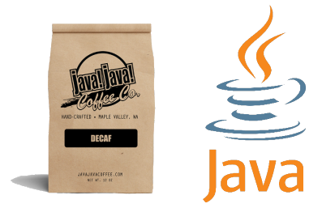

# Breve história do Java

## Bem-vindo ao mundo Java

Desde seu lançamento, em maio de 1995 pela Sun Microsystems, a plataforma Java foi adotada mais rapidamente do que qualquer outra linguagem de programação na história da computação.

Uma referência no mercado de desenvolvimento de software, o Java tornou-se popular pelo seu uso na internet e por proporcionar ambiente de execução em navegadores, mainframes, sistemas operacionais, celulares, cartões inteligentes etc. Por muito tempo, em vista da evolução de suas características empresariais, o Java é uma das linguagens de programação mais utilizadas no mundo.

## Como tudo começou...

Em 1990, a Sun Microsystems iniciou um projeto, denominado Green Project, com o objetivo de conectar computadores a outros equipamentos, como eletrodomésticos e outros dispositivos do dia-a-dia. Os idealizadores do projeto foram **Patrick Naugthon**, **Mike Sheridan** e **James Gosling**.

> Bem antes de se sonhar com a possibilidade de uma Internet das Coisas (IoT), a Sun já concebia a ideia de que um dia tudo estaria de fato conectado. 

## Uma nova linguagem

Para conseguir criar um sistema que permitisse a comunicação entre dispositivos diferentes, o Green Team teria que desenvolver uma linguagem de programação nova que superasse o C++ que utilizava muita memória. Em 1991, James Gosling criou o greenTalk que, posteriormente, foi chamado de Oak.

> A ideia de Gosling era criar um interpretador para pequenos dispositivos, facilitando a reescrita de software para outros aparelhos eletrônicos.

## StarSeven

Pouco tempo depois, em setembro de 1992, a equipe desenvolveu um protótipo chamado *7 (Star Seven): um controle remoto com uma interface gráfica touchscreen, uma tela LCD colorida de 5 polegadas, rede sem fio de 900 MHz, áudio multimídia e entrada PCMCIA,  que prometia controlar os eletrodomésticos e as lâmpadas de uma casa, trazendo um "ar" de ambiente futurista.

O Star Seven possuía uma mascote que auxiliava o usuário a usar os comandos do dispositivo, tornando a interação mais amigável e dinâmica.

## Maaass...

O mercado de dispositivos eletrônicos não estava se desenvolvendo como o esperado e, por falta de patrocínio e interesse por parte das empresas, só foram fabricados 6 aparelhos referentes ao projeto Star Seven. Graças a isso, o projeto foi classificado como inviável e foi arquivado.

> O Star Seven foi o antecessor da ideia de interação digital, presente nos televisores digitais atualmente. Era a ideia certa, mas na época errada.

## Web Runner

Em 1994, a World Wide Web (WWW) se tornou popular e a internet passou a fazer parte da vida das pessoas. Com a chegada da web, a Sun percebeu que poderia utilizar a linguagem de programação criada em 1992 para escrever programas em diferentes plataformas. Então, foi criado o projeto WebRunner (clone do navegador Mosaic) que, em 1994, utilizando a linguagem Oak, deu vida pela primeira vez a objetos animados e a conteúdo executado dinamicamente dentro de um navegador Web (não havia nada parecido antes).

## Surge o JAVA...

Em 1995, a linguagem Oak foi adaptada para a internet. Entretanto, no momento de registrar a linguagem, foi descoberto que o nome Oak já estava em uso. James Gosling e seus companheiros decidiram batizar a linguagem como "Java", um termo utilizado por muitos estadunidenses para se referir ao café forte.

## ...e o HotJava!!!

Assim como a linguagem Oak foi renomeada para Java, o projeto WebRunner foi renomeado para HotJava e foi anunciado pelo Diretor de Ciência da Sun Microsystem, John Gage, na conferência SunWorld.

## Da primeira versão...

Em 1996, a linguagem Java teve sua primeira versão, o JDK ou Java 1.0 que foi criada para ser compatível com os browsers mais antigos até os dias de hoje.

## ...à exploração espacial!!! 
Em 2004, a NASA enviou um Robô para o planeta Marte, como o objetivo de mapear o solo Marciano. Toda a comunicação entre o Robô e os computados presentes na NASA foi realizada através da linguagem Java.

> Os cientistas e engenheiros da NASA tramaram as andanças do Spirit com o Science Activity Planner, software baseado em Java que funcionava como um "Gran Turismo" digital.

## E tantos outros...

Em 2007, o java é implementado em blu-rays e outras diversas ferramentas ganharam destaque no JavaOne.

## Java morrendo...

Nos últimos anos, com o advento da computação em nuvem e microsserviços (que exigem tamanho reduzido e inicialização bastante rápida), onde containers, Kubernetes, serverless e o desenvolvimento de aplicações nativas em cloud podem entregar níveis mais altos de produtividade e eficiência, o Java começou a ficar para trás.

## ...ou será que não!!!

Para alcançar o mundo cloud, a RedHat desenvolveu o framework Quarkus, inspirado nas partículas elementares que compõem o átomo. É um framework nativo de Kubernetes, projetado para GraalVM e HotSpot, desenvolvido a partir das melhores bibliotecas e padrões Java e com objetivo principal de tornar o Java a principal plataforma em Kubernetes e ambientes serverless. Oferece a desenvolvedores um modelo unificado de programação reativa e imperativa, otimizando o endereçamento de uma ampla gama de arquiteturas de aplicativos distribuídos.

## Java supersônico!!

De acordo com a RedHat, a solução traz um novo framework Java (com os adjetivos de Subatômico e Supersônico), extremamente mais leve (menos espaço de memória e menor carga de CPU) e com a inicialização bastante rápida, o que torna o Java mais adequado às novas tecnologias de cloud computing, com uma produtividade muito alta, aproveitando tudo de bom que existe no mundo Java.

