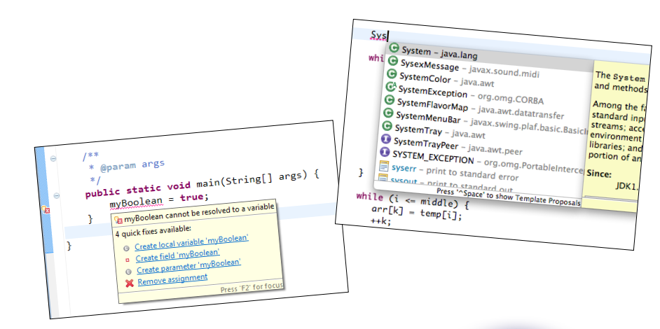
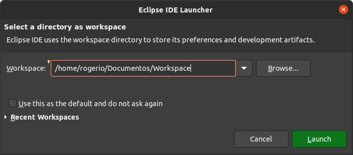
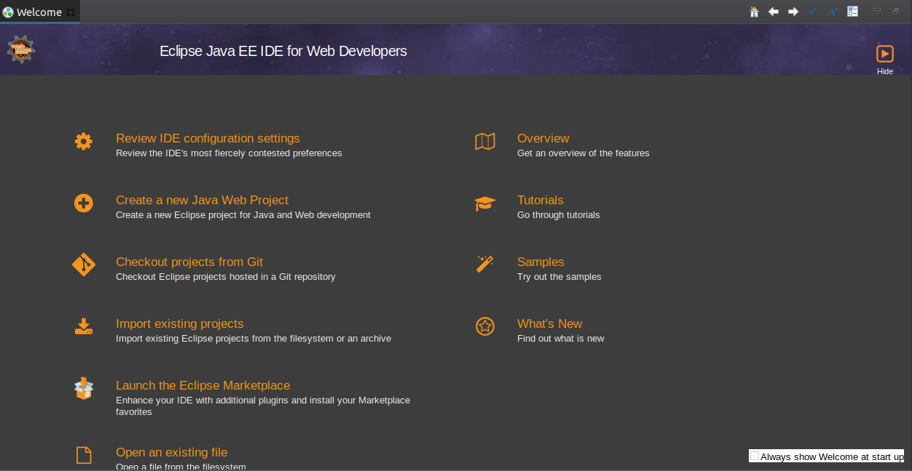
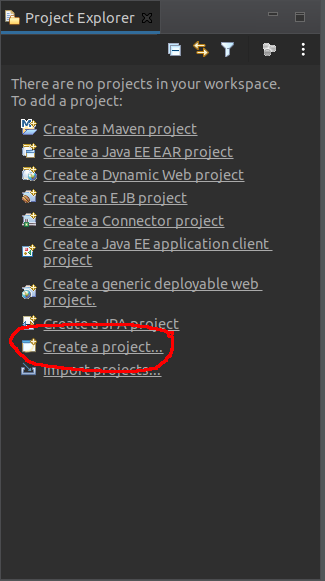

# IDE (Integrated Development Environment)

Um **Integrated Development Environment** (IDE) ou Ambiente de Desenvolvimento Integrado é um software para criação de aplicações que combina ferramentas comuns de desenvolvimento em uma única interface gráfica do usuário com o objetivo de ajudar os desenvolvedores a programar novas aplicações de forma rápida.

> O IDE é uma parte importante do trabalho em Java, pois ajuda a editar o código, gerenciar os arquivos e compilar os projetos.

## Em que o IDE nos ajuda?

A utilização de um IDE, de maneira geral, aumenta bastante a produtividade do desenvolvedor através de recursos como preenchimento inteligente, geração automática de código e identificação em tempo real de bugs causados por erro humano.

## Eclipse

O Eclipse é um IDE gratuito e open-source, conhecido por ser um dos melhores IDEs atualmente. Além de possuir uma grande quantidade de ferramentas, ele é bem simples de usar e roda em qualquer sistema operacional, por ser escrito em Java. Um dos recursos mais importantes do Eclipse é a interface de plugins que permitem sua utilização com diversas linguagens além de Java, tais como C/C++, Python, PHP e inclusive para a plataforma Android.

> Originalmente criado pela IBM, hoje em dia o programa é mantido pela ECLIPSE FOUNDATION, e seu código é aberto a qualquer um que queira colaborar.

### Workspace

A workspace é uma pasta que, normalmente, contém projetos e configurações do Eclipse. Quando executado, o Eclipse solicita que o usuário selecione uma pasta como workspace.

> Podemos ter várias workspaces para organizar conjuntos de projetos e configurações independentemente.

### Welcome

A primeira tela do Eclipse (welcome) mostra "links" para alguns tutorias, exemplos, visão geral da ferramenta, entre outras coisas.

### Criação de projeto Java

1 - Na seção **Project Explorer** (à direita), selecione a opção **Create a project...**.

2 - Selecione **Java Project** e clique em **Next**.

3 - Escolha um nome para o projeto e clique em **Finish**.

