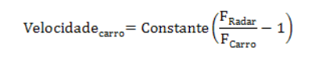

# Atividade Avaliativa

## Radar Rodoviário

Todos que dirigem nas estradas do Brasil já passaram por postos policiais rodoviários que utilizam estes conhecidos radares para detectar infratores que trafegam acima dos limites de velocidade estabelecidos.

O primeiro radar foi construído em 1904, por C. Hülsmeyer na Alemanha, mas o custo e a precisão só tornaram o aparelho viável na década de 30. Hoje o funcionamento de um Radar é bem conhecido e amplamente utilizado.

Os primeiros radares rodoviários utilizavam o princípio da Física conhecido como Efeito Doppler. Através da diferença de frequência entre o objeto em movimento (carro) e o aparelho estacionário (radar rodoviário) é possível calcular a velocidade do veículo pela equação:



> onde a constante = 300

As frequências são medidas pelo aparelho e este calcula a velocidade do carro.
Uma vez calculada a velocidade do veículo, se este estiver acima da velocidade permitida em até 20%, o Código Nacional de Trânsito prevê uma multa de R$ 127,69, equivalente a uma infração grave, além dos 5 pontos na CNH. Se a velocidade for superior a 20%, a infração é considerada gravíssima e a multa será de R$ 574,62, o motorista receberá 7 pontos, terá sua CNH recolhida e receberá suspensão do direito de dirigir.

Naturalmente, os radares atuais também utilizam outras técnicas e ajustes eletrônicos que permitem uma grande precisão, mas é irrelevante para esta avaliação.

Considere que a frequência do radar seja sempre Fradar = 1 (o radar está parado) e faça um programa em que deve ser dadas a frequência do carro, e a velocidade máxima da estrada, o programa calcule a velocidade do veículo e, em caso de infração defina o valor da multa.


### Exemplo

Um carro circula em uma rodovia que possui velocidade máxima de 120 Km/h e ao passar pelo radar, este registra Fcarro = 0,7 (medida da frequência do carro). Com esta medida, o carro terá velocidade registrada de 128,6 km/h. Como esta velocidade está acima do limite permitido, mas é inferior a 20 % deste limite (que seria 144 km/h), receberá uma multa de R$ 127,69.


#### Entrada
`Frequência do carro:` 0,7  .
`Velocidade limite:` 120


#### Saída
`Velocidade do carro:` 128,6 km/h.
`Multa de:` R$ 127,69


### Tarefa

Crie uma classe chamada `AtividadeAvaliativa<SeuNome>` com o método **main** com as variáveis de entrada e calcule a velocidade do carro e o valor da multa.


#### Casos de teste

Entrada
> `Frequência do carro:` 0,7
> `Velocidade limite:` 120

Entrada
> `Velocidade do carro:` 128,6 km/h
> `Multa de:` R$ 127,69

--------------------------------------------

`Frequência do carro:` 0,8  .
`Velocidade limite:`	120
> `Velocidade do carro:` 75 km/h.
> `Multa de:` R$ 0

--------------------------------------------

`Frequência do carro:` 0,65  .
`Velocidade limite:`	120
> `Velocidade do carro:` 161,5 km/h.
> `Multa de:` R$ 574,62


### Resolução

``` java
public class AtividadeAvaliativaRogerioMorais {
	
	public static void main(String[] args) {
		System.out.println("404 - Not Found");
	}

}

```


