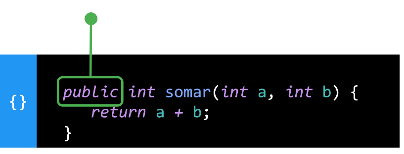
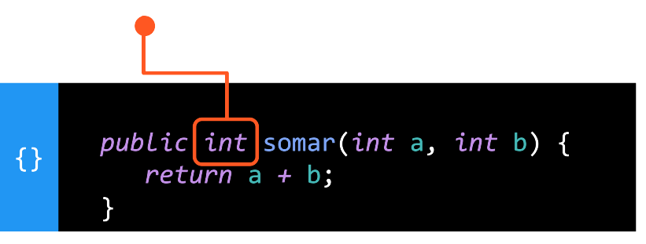
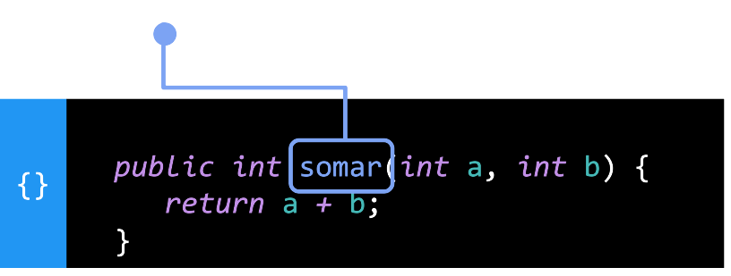
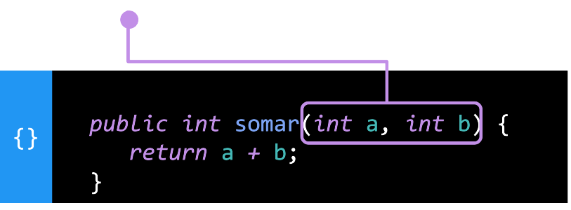
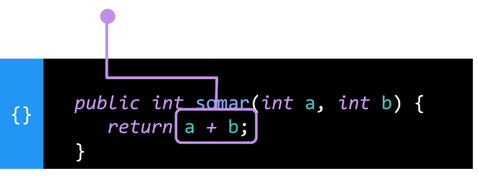
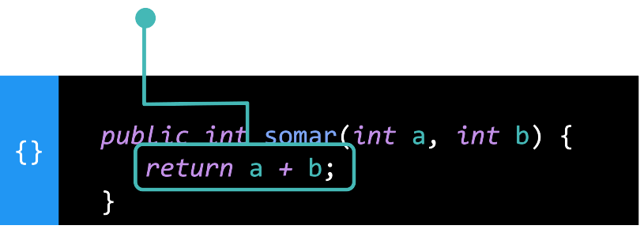
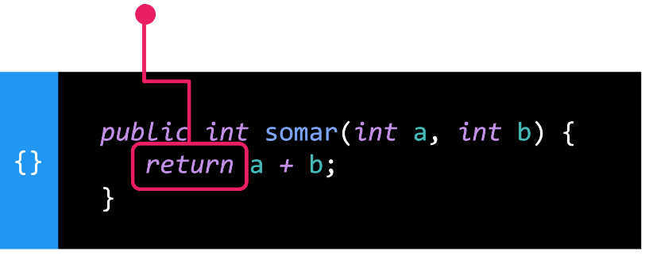

# Métodos de Classe

Um método é um **bloco de código** que podemos invocar quantas vezes forem necessárias, permitindo **agrupar o código** que vamos **utilizar muitas vezes**.

## Estrutura de um método

### Modificador de Acesso

Usamos a palavra `public` para informar ao Java que podemos utilizar o método em outro lugar.



### Tipo do resultado

Definimos o `tipo` de retorno do resultado do processo que estamos fazendo dentro do método.



### Nome

Definimos um `nome` para nos referirmos ao nosso método quando quisermos invocá-lo.



### Parâmetros

Escrevemos os parênteses e, dentro deles, os parâmetros da função separados por vírgulas.



Dentro de nosso método, podemos acessar os parâmetros como se fossem variáveis.



### Corpo

Entre as chaves de abertura e fechamento escrevemos o código que queremos que seja executado toda vez que invocamos o método.



### Retorno

Para retornar ao exterior o resultado do processamento que estamos fazendo dentro do método, usamos a palavra reservada `return` seguida do que quisermos devolver.



## Exemplo de Método

Com os métodos, podemos fazer muitas coisas, mas vamos começar com algo fácil. Veja esse exemplo onde o método a seguir dobra o valor do número que passamos para ele:

```java
public int dobrar(int num) {
   return num * 2;
}
```
