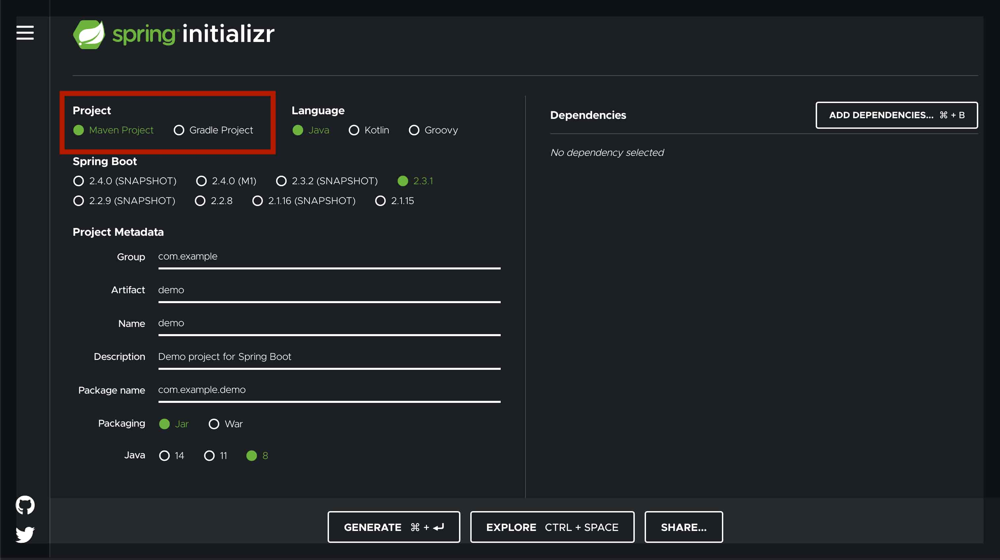
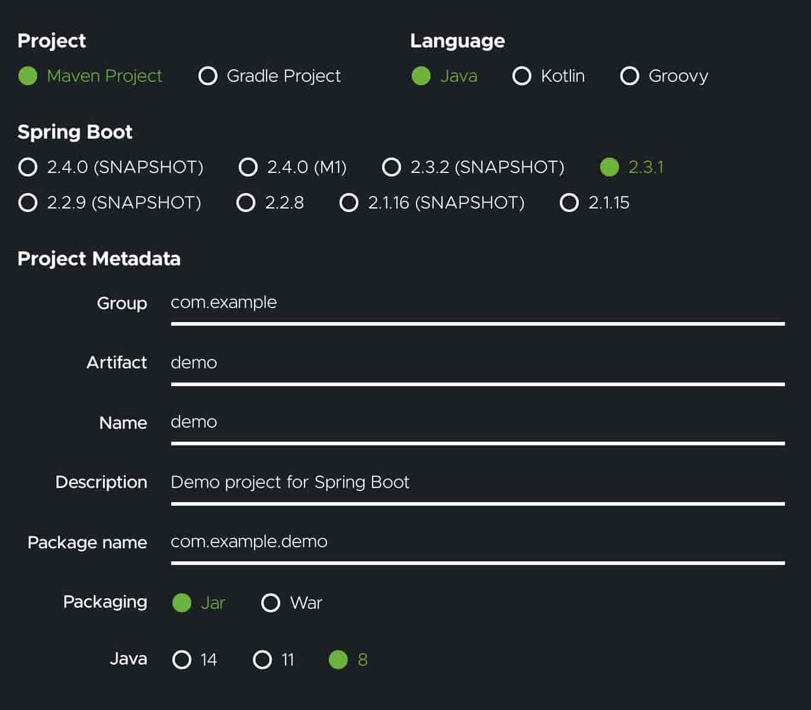
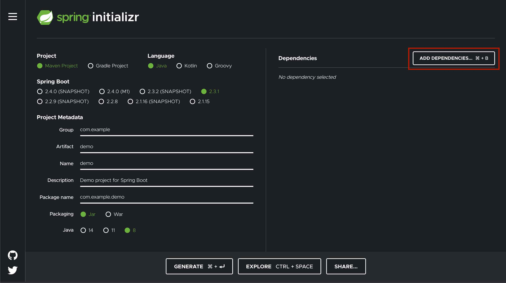
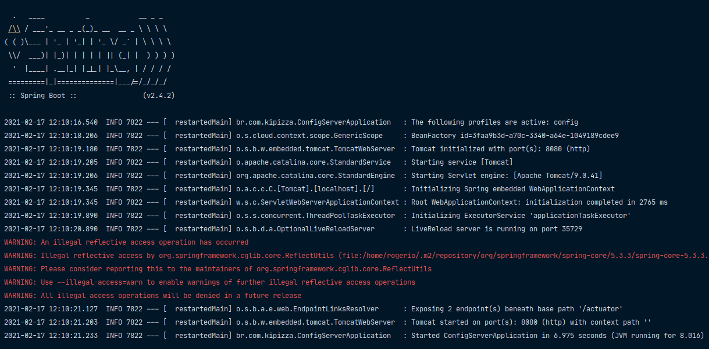

# Spring Framework


O Spring é um framework que proporciona ao desenvolvedor diversas tecnologias que simplificam o desenvolvimento de código de infraestrutura.

Criado por Rod Johnson, oferece diversos módulos que podem ser usados de acordo com as necessidades do projeto, tais como: desenvolvimento Web, persistência, acesso remoto e programação orientada a aspectos.

## Spring Boot


O Spring Boot soluciona a complexidade da inicialização e gerenciamento de dependências de maneira opinativa e automática de um projeto com Spring, tratando de maneira coesa e eficiente a questão da configuração, simplificando a execução do projeto em tempo de desenvolvimento e depuração.

## O que é Spring Initializr?

Spring initializr é um site que pode ser usado para configurar um projeto Spring Boot de maneira rápida e fácil.


## Configurar projeto Spring Boot

1 - Acesse o site do Spring Initializr `https://start.spring.io/`.

2 - Selecione a ferramenta de construção que deseja usar. Maven é selecionado por padrão.



3 - Em seguida, configure: 
- a linguagem de programação desejada (Java é a padrão)
- a versão do Spring Boot que deseja usar (versão mais recente é a padrão)
- os metadados do projeto (group, artifact, name, description, package)
- o empacotamento do projeto: jar ou war
- versão específica do Java, se desejar (Java 8 é vem por padrão)



4 - Clique no botão `Add dependencies` e uma lista pop-up aparecerá para pesquisar as dependências que desejar.



5 - Clique no botão `Generate` para baixar o arquivo zip. 

## application.properties

Dentro da pasta **src/resources** é criado um arquivo chamado `application.properties` onde são informadas as propriedades para serem utilizadas numa aplicação, tais como: nome, porta, configurações de banco de dados, etc. 

```txt
projeto
└── src
    └── main
        ├── java
        └── resources
            └── application.properties
```

### Execução da aplicação

O Spring Boot cria uma classe com sufixo **Application** que se trata da classe de entrada porque possui o método `main()` e pela invocação de `SpringApplication.run()`.

``` java
@SpringBootApplication
public class EtecApplication {

	public static void main(String[] args) {
		SpringApplication.run(ApiGatewayApplication.class, args);
	}

}
``` 

Para executar uma aplicação Spring Boot basta clicar com o botão direito na classe **Application** e acessar **Run as -> Java Application**. O Spring fará o _build_ e a execução do projeto, com as etapas _logadas_ no console.



> Por padrão, a aplicação será executada na porta 8080 do computador conforme dados informados no console do Eclipse.

