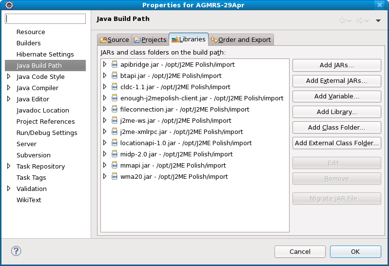

# Maven


Maven é uma ferramenta de integração de projetos responsável por gerenciar dependências, controlar versão de artefatos, gerar relatórios de produtividade, garantir execução de testes, manter nível de qualidade do código, dentre outras.

## Por que Maven

O processo de criação de um projeto Java, em geral, envolve a obtenção (via cópia ou download) de bibliotecas auxiliares ao projeto e, posteriormente, a execução dos testes unitários, a criação dos pacotes de publicação, a geração de documentação javadoc, entre outras etapas. Projetos complexos, com vários módulos, podem precisar que os módulos sejam compilados em determinada ordem, para que o pacote final seja criado.

As mudanças estruturais realizadas por um desenvolvedor têm que ser comunicadas a cada um dos demais membros da equipe, para que o projeto continue a compilar no computador de cada um. 



Com o Maven conseguimos isolar as bibliotecas usadas no projeto em um repositório compartilhado pela equipe ou no repositório central do Maven.
 
# pom.xml

O POM (Project Object Model) é um arquivo que descreve uma série de configurações que o projeto terá e quais repositórios e dependências o projeto precisará.

``` xml
<?xml version="1.0" encoding="UTF-8"?>
<project xmlns="http://maven.apache.org/POM/4.0.0"
         xmlns:xsi="http://www.w3.org/2001/XMLSchema-instance"
         xsi:schemaLocation="http://maven.apache.org/POM/4.0.0 http://maven.apache.org/xsd/maven-4.0.0.xsd">
    
    <modelVersion>4.0.0</modelVersion>

    <parent>
        <groupId>org.springframework.boot</groupId>
        <artifactId>spring-boot-starter-parent</artifactId>
        <version>2.4.2</version>
        <relativePath/>
    </parent>

    <groupId>br.com.etechoracio</groupId>
    <artifactId>sihas</artifactId>
    <packaging>pom</packaging>
    <version>1.0-SNAPSHOT</version>

    <properties>
        <java.version>11</java.version>
    </properties>

    <dependencies>

        <dependency>
            <groupId>org.springframework.boot</groupId>
            <artifactId>spring-boot-starter-web</artifactId>
        </dependency>

        <dependency>
            <groupId>org.springframework.boot</groupId>
            <artifactId>spring-boot-devtools</artifactId>
            <optional>true</optional>
        </dependency>

    </dependencies>

</project>
``` 

#### Cabeçalho do pom.xml

No cabeçalho temos algumas tags que definem:
- a versão do modelo de POM utilizado
- o GroupId que seria algo como o prefixo da estrutura de pacotes do projeto
- o ArtifactId que define o nome do artefato final .war ou .jar terá quando empacotado
- o Version com a versão do projeto que irá complementar o nome do artefato. 
- a tag Name que define o nome do projeto.

``` xml
<modelVersion>4.0.0</modelVersion>
<groupId>br.com.etechoracio</groupId>
<artifactId>teste</artifactId>
<version>1.0-SNAPSHOT</version>
<name>teste</name>
``` 

#### Tag properties

Possibilita definir, por exemplo, as versões do Java e de dependências incluídas no projeto. 
``` xml
<properties>
    <java.version>11</java.version>
    <spring-cloud.version>2020.0.0</spring-cloud.version>
    <apt-maven-plugin.version>1.1.3</apt-maven-plugin.version>
</properties>
``` 

#### Tag dependencies

A tag `dependencies` define quais serão as dependências utilizadas no projeto.

``` xml
<dependencies>
    <dependency>
        <groupId>org.springframework.boot</groupId>
        <artifactId>spring-boot-starter-web</artifactId>
    </dependency>
</dependencies>
``` 
#### Tag repositories

Define uma lista de repositórios que serão acessados pelo Maven para baixar as dependências. 

``` xml
<repositories>
    <repository>
        <id>spring-milestones</id>
        <name>Spring Milestones</name>
        <url>https://repo.spring.io/milestone</url>
    </repository>
</repositories>
``` 
