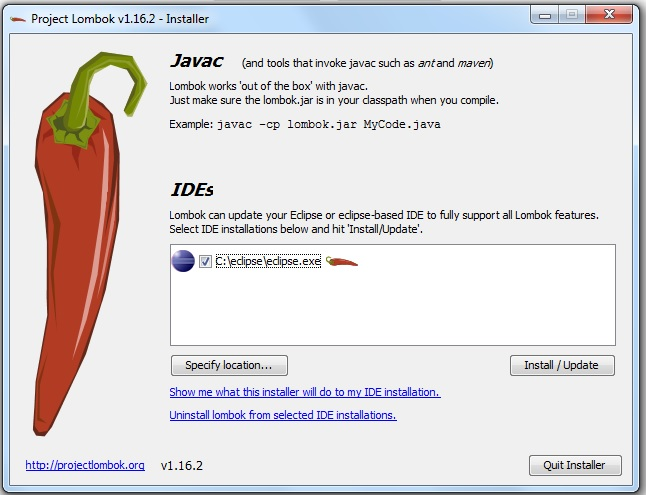
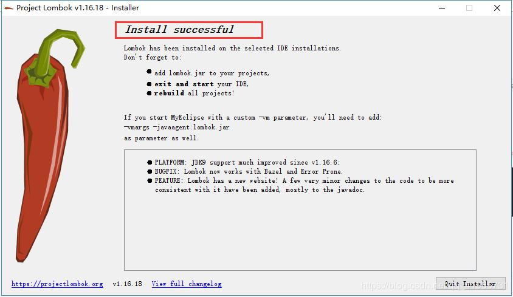

# Java menos verboso com Lombok

O Lombok é um framework que visa diminuir a verbosidade das classes, evitando a repetição de códigos "clichês", como _getters e setters_, _equals e hashCode_, _toString_, construtores, etc.

> Assim, o código fica mais limpo e claro através de anotações para gerar tais estruturas automaticamente.

Para se ter uma noção mais exata do efeito que o lombok pode trazer às classes de um projeto, veja a diferença:

##### classe criada da forma tradicional

```java
public class FormaPagamento {
    
    private Integer id;
    private String nome;
    private TipoFormaPagamentoEnum tipo;
    private LocalDateTime dataFimVigencia;

    public Integer getId() {
    	return id;
    }

    public void setId(Integer id) {
    	this.id = id;
    }

    public String getNome() {
    	return nome;
    }

    public void setNome(String nome) {
    	this.nome = nome;
    }

    public TipoFormaPagamentoEnum getTipo() {
    	return tipo;
    }

    public void setTipo(TipoFormaPagamentoEnum tipo) {
    	this.tipo = tipo;
    }

    public LocalDateTime getDataFimVigencia() {
    	return dataFimVigencia;
    }

    public void setDataFimVigencia(LocalDateTime dataFimVigencia) {
    	this.dataFimVigencia = dataFimVigencia;
    }
    
}
```

##### classe criada usando o Lombok

```java
@Getter
@Setter
public class FormaPagamento {

    private Integer id;
    private String nome;
    private TipoFormaPagamentoEnum tipo;
    private LocalDateTime dataFimVigencia;

}
```


> É possível escrever menos código com auxílio do Lombok e existem outras anotações que podem ser utilizadas para enxugar ainda mais o código Java.


### Integrando o Lombok ao Eclipse

1 - Faça o download do jar do Lombok diretamente do site do projeto ou nesse link direto: [Download Lombok](https://projectlombok.org/downloads/lombok.jar)

2 - Execute o Lombok clicando duas vezes no arquivo.

3 - Após executar o lombok.jar, aparece uma tela do instalador do Lombok e, caso o Eclipse não for encontrado, clique em `Specify location...` e selecione a pasta onde está o Eclipse.



4 - Aparecerá a tela indicando o sucesso (ou não) da instalação.



4 - Feche (se estiver aberto) e abra o Eclipse novamente.
